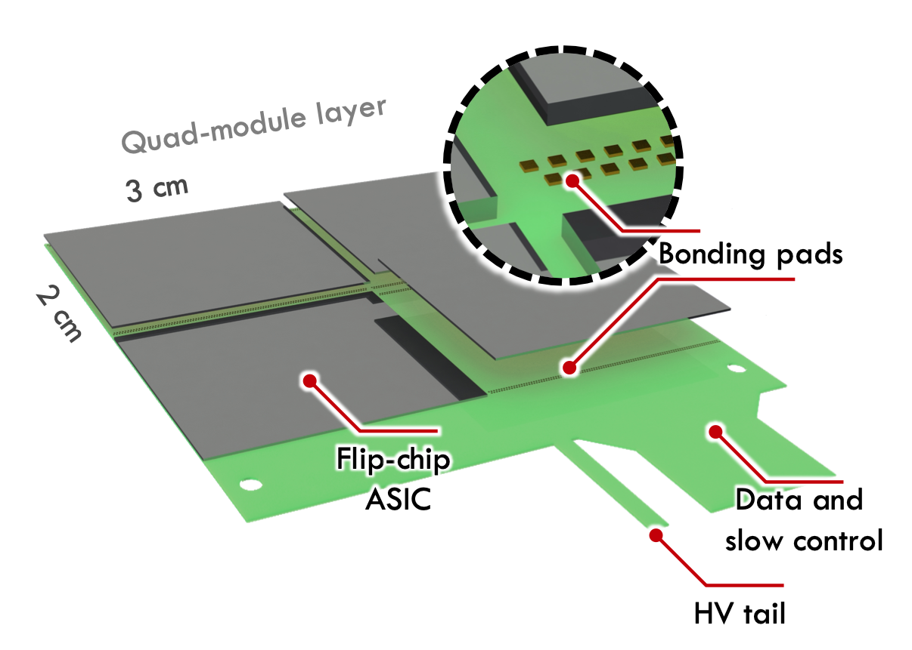
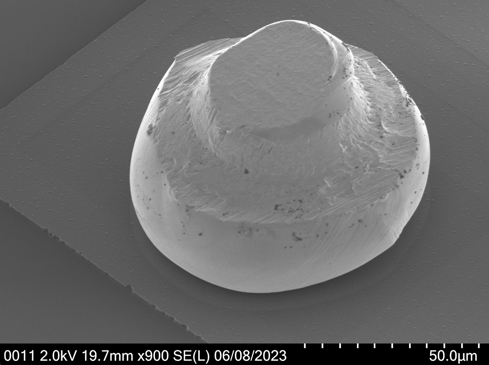
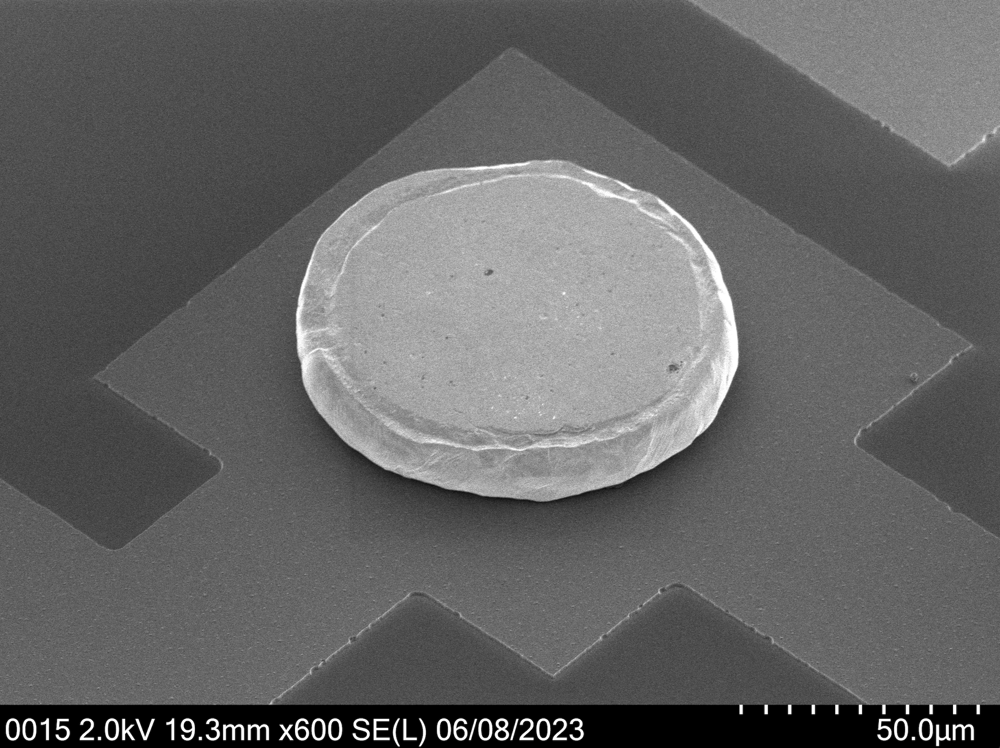
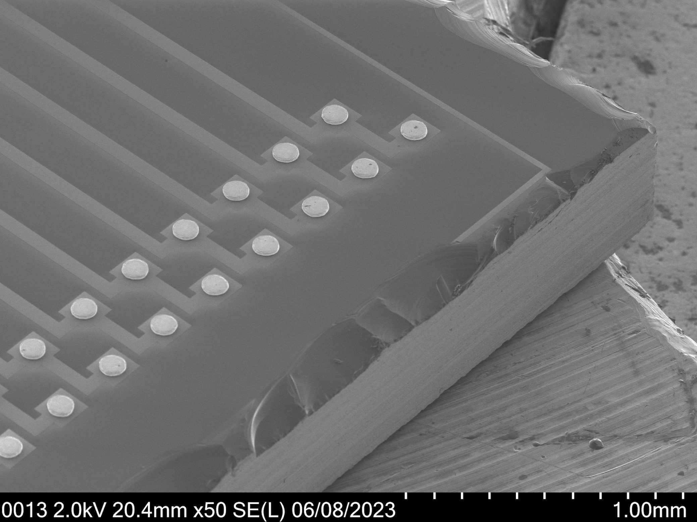

This section is meant to document the plans for the ASIC integration into the scanner.

The scanner assembly starts with the integration of 4 detectors ASICs into a Flexible-Printed-Circuit (FPC), creating a scanner's layer module, in a 2x2 arrangement with 300 µm gap between chip edges. Figure X shows an illustration of the layer module.

The ASICs will have Au stud bumps (about 60 microns diameter and 45 microns height, before possible coining, show in Figure X) on each bonding pad and the connection to the FPC will be via flip-chip to matching bonding pads (ENIG), using Araldite 2011 to bond the assembly mechanically. 

   

        
        
Gold stud bump from NMP-FCBG

    

   

        
        
Coined Au stud with 200g

    

   

        
        
Chip's edge with Au stud bumps

   

Each FPC will host small 0201 SMD components in small regions close to the top and bottom peripheries of the 2x2 chip arrangement, shown in the red region in Figure X below. The data lines and low-voltage power for the ASIC are routed via the a wide flex tail (to be connected to a rigid board hosting a ZIF connector), while the high-voltage for sensor biasing is routed via a thin flex tail with a dedicated HV connector (200 V, <1 mA). 

The width of the flex is from 100 to 200 µm smaller than the width of the 2x2 chip arrangement, at least in the region of where the chips are placed to allow an external cooling block to mechanicaly be in contact with the lateral edges of the chips for cooling optimization. 

60 layer modules will be stacked using alignment pins to constrain the relative position of the many layers.

The assembly of the layer module consists in loading the 4 detector ASICs and the FPC into their respective parts of an assembly jig. 
The two parts will be brought into proximity using alignment pins and micropositioners. 
The alignemnt between the chips and the flex will be done using metalic fiducial marks in the FPC and the ASICs silicon edges. 
The alignemt is done via the micropositioners through inspection holes in the assembly jig and FPC. 
Having the adhesive glue already dispensed in the FPC, thermocompression will be applied to bond the chips to the flex. 

This assembly technique will be qualified by building a scanner mockup using devices and tool as close as possible to the final scanner to be built.
This will be described in the following sections.
