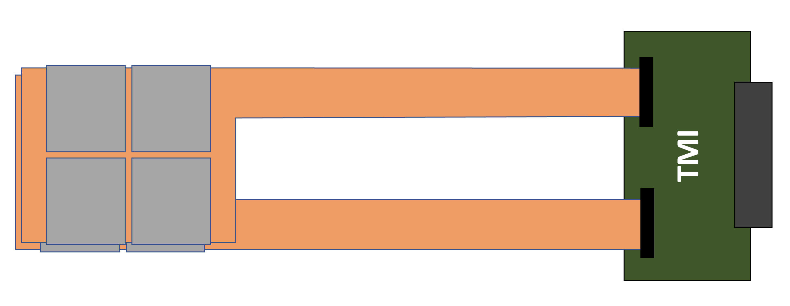
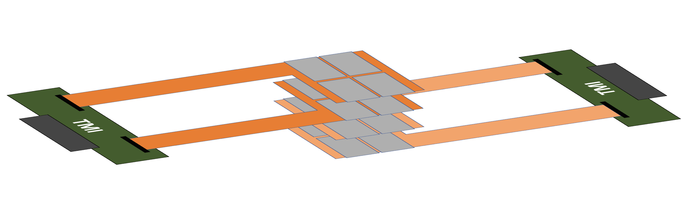
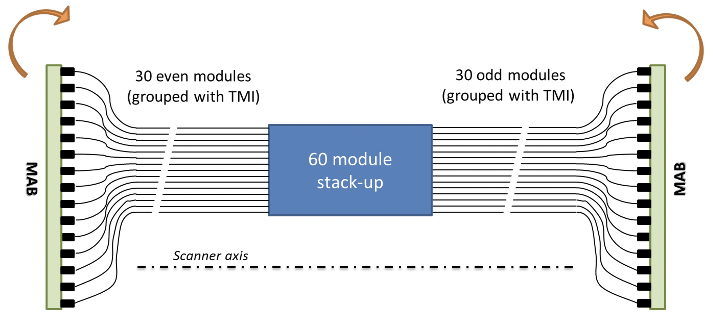

Two consecutive modules will be connected via their pigtails to a TMI (Two Module Interface) board as represented in the image below. 

   	
   	

		The consecutive modules odd and even are interconnected to a two module interface board called TMI. Each TMI will then be connected to a backplane board called MAB (Module Adapter Board).
  	

 

The two modules connected via the TMI is called a double-layer module, and these will be stacked with a rotation of 180 degrees (in the ASIC plane) so the module's tails of consective DLMs goes in opposite directions.

   	
   	

		The consecutive modules odd and even are interconnected to a two module interface board called TMI. Each TMI will then be connected to a backplane board called MAB (Module Adapter Board).
  	

 
This will lead to have 15 TMIs to be connected to a backplane called module adapter board (MAB) at each side of a tower. 
The backplane will drive all the io and power lines with a plugin FPGA card for the high speed signal processing and for power supply it will drive through connectors from the power crate.

The picture illustrates the electrical interfaces of a tower with an indication of how the module adapter board (MAB) will be rotated.

   	
   	

	   Tower consisting of 60 modules stacked up with pigtails and TMI connected on the two sides to the module adapter board.
  	

