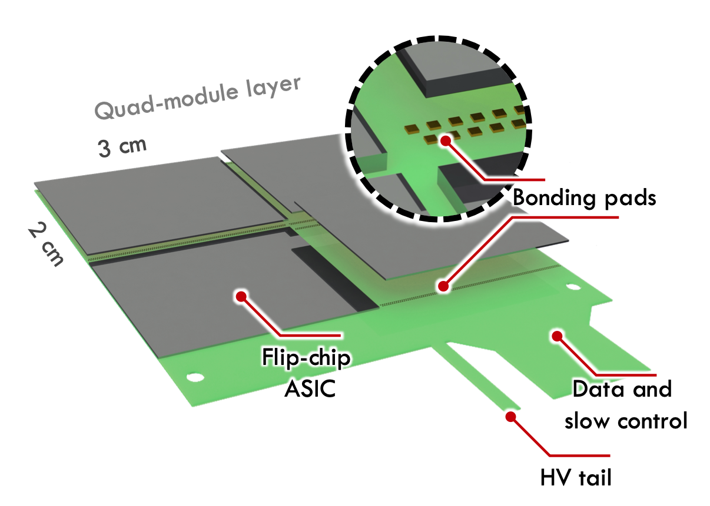
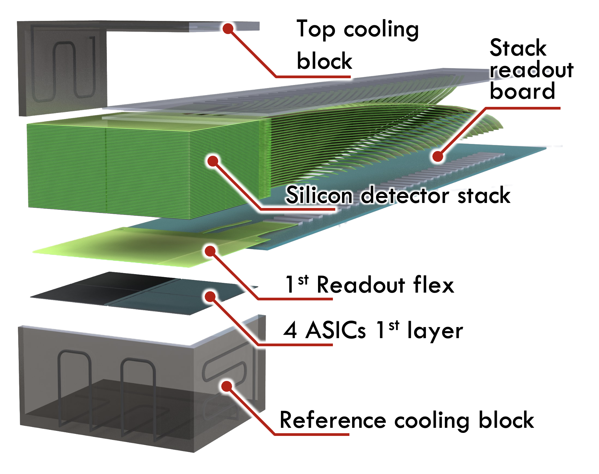

This section is meant to document the plans for the ASIC integration into the scanner.

The scanner assembly starts with the integration of 4 detectors ASICs into a Flexible-Printed-Circuit (FPC), creating a scanner's layer module, in a 2x2 arrangement with 300 µm gap between chip edges. Figure X shows an illustration of the layer module.

60 layer modules will be stacked using alignment pins to constrain the relative position of the many layers.

