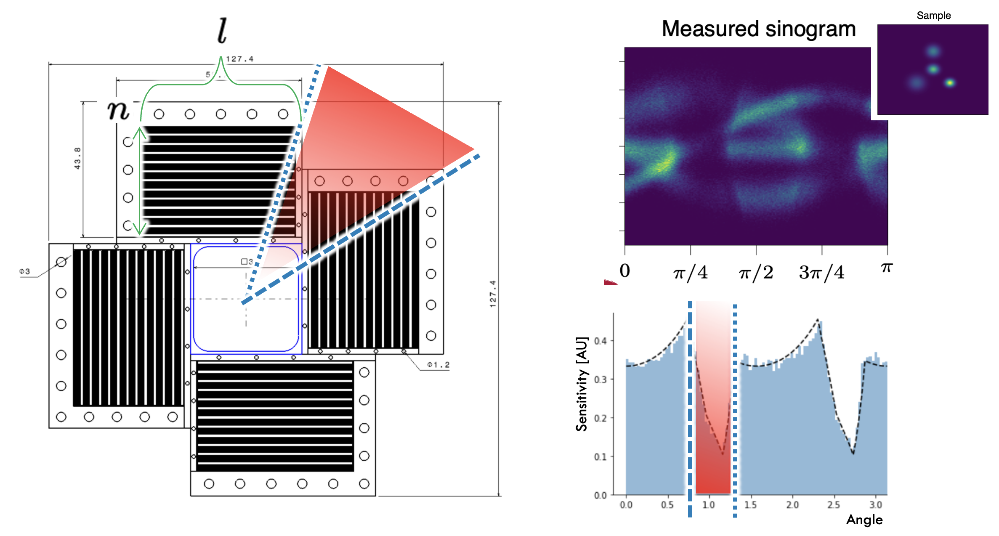

This section is meant to document the plans for the ASIC integration into the module, module into the tower, and tower into the scanner with mechanical supports, electronic and cooling services

Regaridng optimization of the scanner sensitivity, highly influenced by scanner geometry, it is important to note that its design should avoid scanner's regions with different stopping power for the annihilation photons, as illustrated below. This will provide a more uniform smapling region for the lines-of-response detected, making sensitivity compensation a second order correction.

