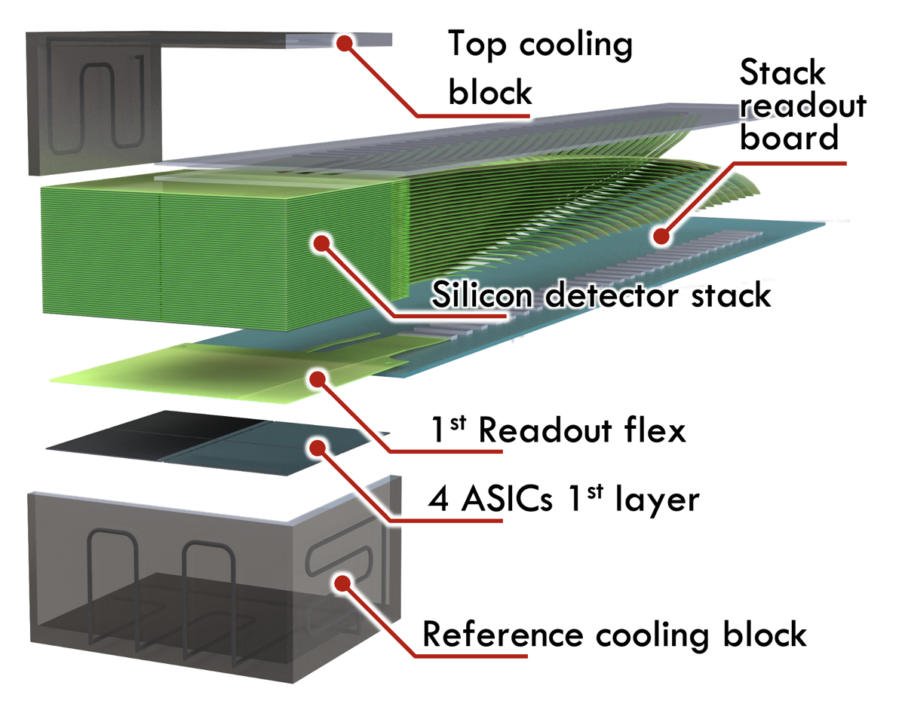
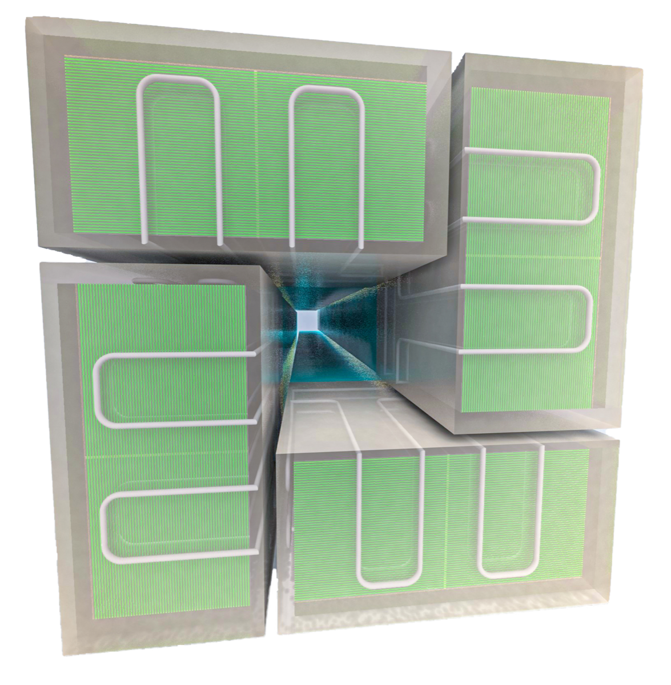

The 100μPET project aims at the construction of a novel generation small-animal Positron Emission Tomography (PET) scanner, with unprecedented volumetric spatial resolution to perform ultra-high resolution molecular imaging of the onset and progression of atherosclerosis in ApoE-/- mice.

The 100µPET will consist of 4 identical towers, each arranged at 90° with respect to its neighbor. Each tower is composed by 60 detection layers, each layer hosting 4 ASICs.

   

        
        

		   Top left edge
        

   

   

        
        

		   Top right edge
        

   

Given the compactness of a tower, with a total thickness of the instrumented layers of ~37 mm, special attention is needed to service the 60 electrically independent modules while targeting to minimize the service interconnection in the tower vicinity and shift it at a distance of ~30 cm from the modules. The services will be distributed on the two sides of a tower to be connected to the back-end readout system..

The next sections will contain the specifications of the different parts that will compose a tower consisting of a stack-up with 60 thinned module layers, going from the front-end towards the back-end parts of the system.
