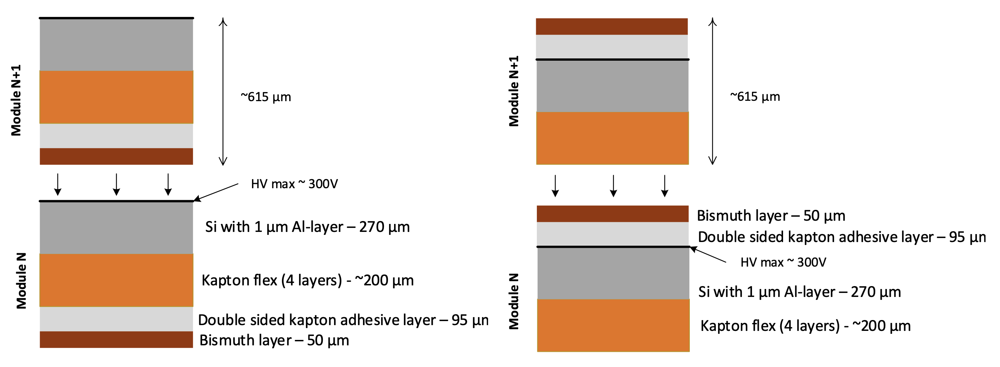

The module consists of an assembly of the following parts:
- 4 chips with gold stud bumps deposited on every contact pad 
- Module flex with an pigtail populated with SMD components
- Bismuth absorber layer

   	
   	

	   Module sketch with identification of the components and features. The module will have two flavors for the odd and even module number in the stack-up with the pigtail located either on the right or on the left hand-side.
  	

 

In the tower the module will be stacked up with odd and even module types.
The two types of module will be distinct by pigtail position located either on the right or on the left.

The power supply and the HV of a module are coming from the module flex. 
The ASIC will be HV biased from the front side (via the IO bonding pads). As the chip's backplane is metalized with Aluminium (**TBC**), it will also be on HV. 
While the bismuth absorber layer needs to be the layer next to the chip's backplane, it does not need to be directly electrically coupled (DC) to the Al-metalized backplane. 

Is this statement correct? Click to see more

If not and given the difference of the standard potential it will trigger an oxidation process on the aluminum layer that is more electronegative (especially in presence of oxygen).  
Is this an issue that the backplane will get oxidized? One possible mitigation solution would be to target Nickel at the backplane instead of Aluminum. 
With respect to the high resistivity of the Bismuth it can be assumed as a semiconductor. 
So Bismuth in itself will not be enough to guarantee a uniform potential at the sensor backplane if the Al layer will be degraded with time. 
As an alternative one can consider having the kapton double side adhesive at the Silicon interface than at the kapton (see the figure above). 
The Bismuth could then be couple directly to the Copper layer of the module flex which should mean no Coverlay at all on both sides for the chip interface on one side and for the bismuth interface on the other side. 

   	
   	

	   Stackup and interface between two consecutive modules. Left hand-side is with the absorber layer glued to the module flex while on the right hand-side it is glued on the silicon sensor-asics.
  	

 

  <a id="hide1" href="#hide1" class="hide">Comment concerning the standard potential of metals - CLICK to expand</a>
  <a id="show1" href="#show1" class="show">Comment concerning the standard potential of metals - CLICK to hide</a>
  

    Indication for a compatibility with the oxidation process:
	
	- Aluminum: - 1.6 V
	- Copper: + 0.3V
	- Nickel: - 0.25 V
	- Bismuth: + 0.3 V
	- Gold: + 1.8 V
  

  <a id="hide2" href="#hide2" class="hide">Comment concerning the resistivity of Bismuth versus other material - CLICK to expand</a>
  <a id="show2" href="#show2" class="show">Comment concerning the resistivity of Bismuth versus other material - CLICK to hide</a>
  

	
	- Aluminum: 2.6 E-8 Ωm
	- Bismuth: 1.29 E-6 Ωm
	- Copper: 1.7 E-8 Ωm
  

### **TODO**
- HV supply strategy to be confirmed (Lorenzo)
- Backplane metallization (Lorenzo)
- Define the electrical interface between chip's backplane and bismuth layer (inputs expected from Yannick)
- Confirmation that ~415 µm envelope is enough to fit the SMD components in between two modules on top of each other (Yannick & all) 

<head>

</head>

