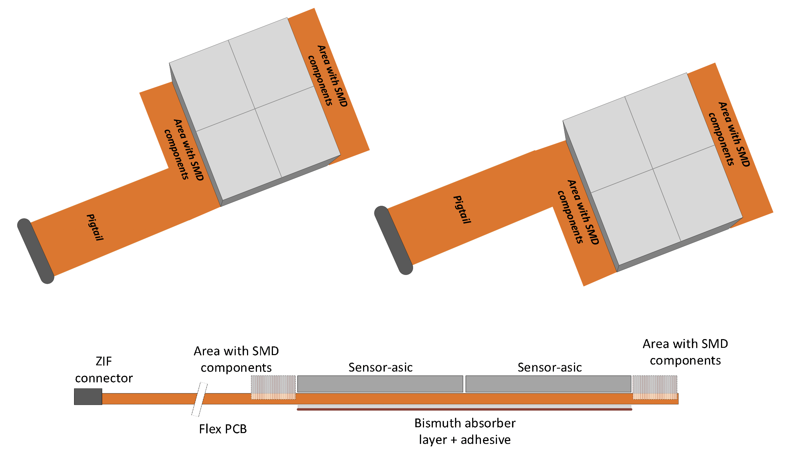

The module consists of an assembly of the following parts:
- 4 chips with gold stud bumps deposited on every contact pad 
- Module flex with an pigtail populated with SMD components
- Bismuth absorber layer

   	
   	

	   Module sketch with identification of the components and features. The module will have two flavors for the odd and even module number in the stack-up with the pigtail located either on the right or on the left hand-side.
  	

 

In the tower the module will be stacked up with odd and even module types.
The two types of module will be distinct by pigtail position located either on the right or on the left.

The power supply and the HV of a module are coming from the module flex. 
The ASIC will be HV biased from the front side (via the IO bonding pads). As the chip's backplane is metalized with Aluminium (**TBC**), it will also be on HV. 

It is yet **TBC** that an absorber layer will be used between the modules to increase the convertion rate of the photons. Please, check the next section for more details.

### **TODO**
- HV supply strategy to be confirmed (Lorenzo)
- Backplane metallization (Lorenzo)
- Define the electrical interface between chip's backplane and bismuth layer (inputs expected from Yannick)
- Confirmation of envelope needed to fit the SMD components in between two modules on top of each other (Yannick & all) 
